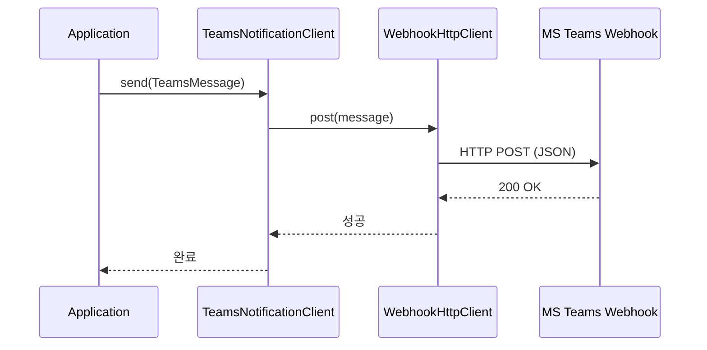
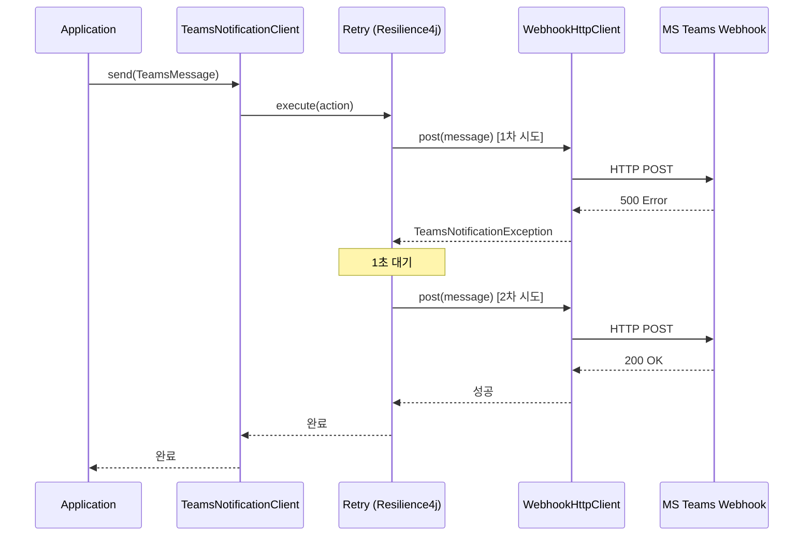
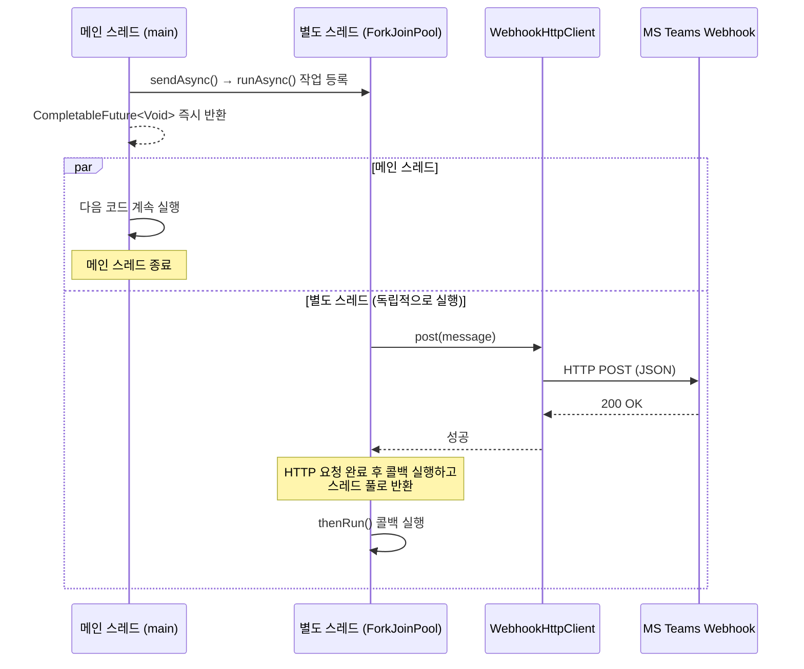

[](https://central.sonatype.com/artifact/io.github.hjc96/teams-notification-core)
# teams-notification

[](LICENSE)
[](https://openjdk.org/)
[](https://spring.io/projects/spring-boot)

MS Teams 채널로 알림을 전송하는 경량 Java 라이브러리입니다.

---

## 주요 기능

- 📨 **텍스트 메시지** — 한 줄 코드로 메시지 전송
- 🎨 **Adaptive Card** — 색상, Facts, 버튼이 포함된 리치 메시지
- 🔄 **자동 재시도** — 고정/지수 백오프 방식 선택 가능
- ⚡ **Spring Boot Auto-Configuration** — `application.yml` 설정만으로 바로 사용
- 🪶 **가벼운 의존성** — core 모듈은 OkHttp와 Jackson만 사용

---

## 동작 방식

### 기본 전송 흐름



### 전송 실패 시 Retry 흐름



### 비동기 전송 흐름



---

## 요구사항

- Java 17 이상
- Spring Boot 3.0 이상

---

## 설치

### Gradle

```groovy
// Spring Boot Auto-Configuration (권장)
implementation 'io.github.hjc96:teams-notification-spring-boot:0.1.0'

// Spring 없이 core만 사용
implementation 'io.github.hjc96:teams-notification-core:0.1.0'
```

### Maven

```xml
<!-- Spring Boot Auto-Configuration (권장) -->
<dependency>
    <groupId>io.github.hjc96</groupId>
    <artifactId>teams-notification-spring-boot</artifactId>
    <version>0.1.0</version>
</dependency>

<!-- Spring 없이 core만 사용 -->
<dependency>
    <groupId>io.github.hjc96</groupId>
    <artifactId>teams-notification-core</artifactId>
    <version>0.1.0</version>
</dependency>
```

---

## 빠른 시작

### 1. `application.yml`에 Webhook URL 추가

```yaml
teams:
  notification:
    channels:
      default:
        webhook-url: https://outlook.office.com/webhook/YOUR_WEBHOOK_URL
```

### 2. 주입 후 사용

```java
@Service
public class DeployService {

    private final TeamsNotificationClient teamsClient;

    public DeployService(TeamsNotificationClient teamsClient) {
        this.teamsClient = teamsClient;
    }

    public void notifyDeploySuccess(String version) {
        TeamsMessage message = TeamsMessage.text()
            .title("배포 완료")
            .body(version + " 버전이 운영 환경에 배포되었습니다.")
            .type(MessageType.SUCCESS)
            .build();

        teamsClient.send(message);
    }
}
```

---

## 사용법

### 텍스트 메시지

```java
TeamsMessage message = TeamsMessage.text()
    .title("서버 알림")
    .body("prod-server-01의 디스크 사용률이 90%를 초과했습니다.")
    .type(MessageType.WARNING)
    .build();

teamsClient.send(message);
```

### Adaptive Card

```java
TeamsMessage message = TeamsMessage.adaptiveCard()
    .title("배포 완료")
    .fact("환경", "운영")
    .fact("버전", "v1.2.3")
    .fact("배포 방식", "GitHub Actions")
    .actionButton("로그 보기", "https://grafana.example.com")
    .type(MessageType.SUCCESS)
    .build();

teamsClient.send(message);
```

### 비동기 전송

```java
teamsClient.sendAsync(message)
    .thenRun(() -> log.info("알림 전송 완료"))
    .exceptionally(e -> {
        log.error("알림 전송 실패", e);
        return null;
    });
```

### 멀티 채널

여러 Teams 채널로 알림을 나눠 보내고 싶다면 채널별 Webhook URL을 별칭과 함께 등록할 수 있습니다.

여기서 `default`, `monitoring`은 Teams 채널명을 자동으로 찾는 값이 아니라, 애플리케이션에서 사용할 **채널 별칭**입니다. 실제 Teams 채널과 1:1로 맞춰도 되고, `deploy`, `error`, `urgent`처럼 목적에 맞는 이름으로 정해도 됩니다.

```yaml
teams:
  notification:
    channels:
      default:
        webhook-url: https://outlook.office.com/webhook/GENERAL_CHANNEL
      monitoring:
        webhook-url: https://outlook.office.com/webhook/MONITORING_CHANNEL
```

`send(message)`는 항상 `default`에 등록된 Webhook URL로 전송합니다.

```java
teamsClient.send(message);
```

특정 별칭으로 보내고 싶다면 `sendTo(channelName, message)`를 사용합니다.

```java
teamsClient.sendTo("monitoring", message);
```

위 예시에서는 `monitoring` 별칭에 등록된 Webhook URL, 즉 `MONITORING_CHANNEL`로 알림이 전송됩니다. `monitoring`이라는 이름 자체가 특별한 것은 아니며, 설정에 등록한 별칭과 코드에서 호출하는 이름이 일치하면 됩니다.

---

## 메시지 타입

| 타입 | 색상 | 사용 예시 |
|------|------|-----------|
| `SUCCESS` | 🟢 초록 | 배포 완료, 작업 성공 |
| `FAIL` | 🔴 빨강 | 에러, 장애, 실패 알림 |
| `WARNING` | 🟡 노랑 | 임계값 초과, 주의 필요 |
| `INFO` | 🔵 파랑 | 일반 정보 전달 |

---

## 설정 옵션

```yaml
teams:
  notification:
    enabled: true                  # 활성화 여부 (기본값: true)
    channels:
      default:
        webhook-url: https://...   # 필수, send(message) 호출 시 사용
      monitoring:
        webhook-url: https://...   # sendTo("monitoring", message) 호출 시 사용
    retry:
      max-attempts: 3              # 재시도 횟수 (기본값: 3)
      wait-duration: 1000ms        # 재시도 간격 (기본값: 1초)
      back-off: FIXED              # FIXED 또는 EXPONENTIAL (기본값: FIXED)
    timeout: 5s                    # HTTP 요청 타임아웃 (기본값: 5초)
```

---

## Webhook URL 발급 방법

1. Microsoft Teams에서 알림을 보낼 채널로 이동
2. **⋯ 더보기** → **커넥터** 클릭
3. **Incoming Webhook** 검색 후 **구성** 클릭
4. 이름 입력 후 **만들기** 클릭
5. 생성된 Webhook URL 복사

> 자세한 방법은 [Microsoft 공식 가이드](https://learn.microsoft.com/ko-kr/microsoftteams/platform/webhooks-and-connectors/how-to/add-incoming-webhook)를 참고하세요.

---

## Spring 없이 사용하기

`teams-notification-core` 모듈은 Spring 없이 독립적으로 사용할 수 있습니다.

```java
TeamsNotificationClient client = TeamsNotificationClient.builder()
    .webhookUrl("https://outlook.office.com/webhook/YOUR_WEBHOOK_URL")
    .timeout(Duration.ofSeconds(5))
    .retryMaxAttempts(3)
    .build();

client.send(TeamsMessage.text()
    .title("안녕하세요")
    .body("테스트 메시지입니다.")
    .type(MessageType.INFO)
    .build());
```

---

## 라이선스

이 프로젝트는 Apache License 2.0을 따릅니다. 자세한 내용은 [LICENSE](LICENSE) 파일을 참고하세요.
